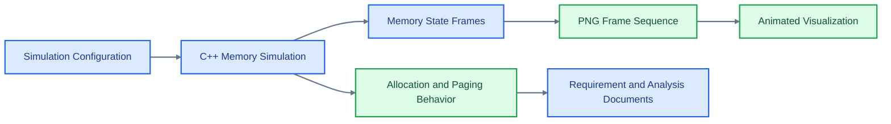

# Memory Management Simulator

<p align="center">

  
  
</p>

<p align="center">
  <strong>A systems-level simulator for visualizing memory allocation, page behavior, and operating-system memory management concepts.</strong>
</p>

Memory Management provides a C++ simulation environment for studying how memory state changes over time. It includes build configuration, visual frame artifacts, and supporting documentation around requirements and implementation behavior.

## Core Capabilities

- Simulates memory-management behavior for operating-systems study.
- Uses CMake for repeatable C++ builds.
- Produces visual frame artifacts for state-by-state inspection.
- Includes requirements analysis and project summary documentation.

## Technical Architecture

The repository is structured as a C++ project with CMake build files, documentation, and generated visualization frames. The design supports both command-line experimentation and visual explanation of memory behavior.

## Architecture Diagram



## Technology Stack

- C++ implementation for systems simulation.
- CMake build workflow.
- Generated PNG/GIF artifacts for memory-state visualization.
- Project requirement documents for traceable implementation planning.

## Repository Structure

- `CMakeLists.txt` - Build configuration.
- `memory.gif` - Rendered memory-management visualization.
- `frames/png` - Generated frame sequence.
- `PROJECT_REQUIREMENTS_ANALYSIS.md` - Requirements analysis.
- `REQUIREMENTS_SUMMARY.md` - Requirement summary.

## Getting Started

```bash
cmake -S . -B build
cmake --build build
```

```bash
./build/Memory-Management
```

## Professional Context

This project demonstrates C++ systems programming, OS concept modeling, and visual technical communication.
